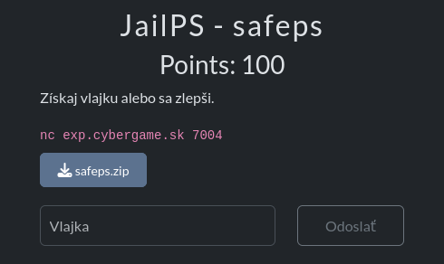
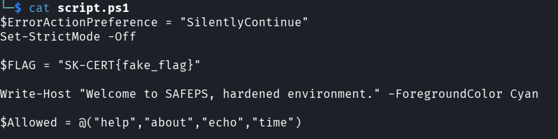
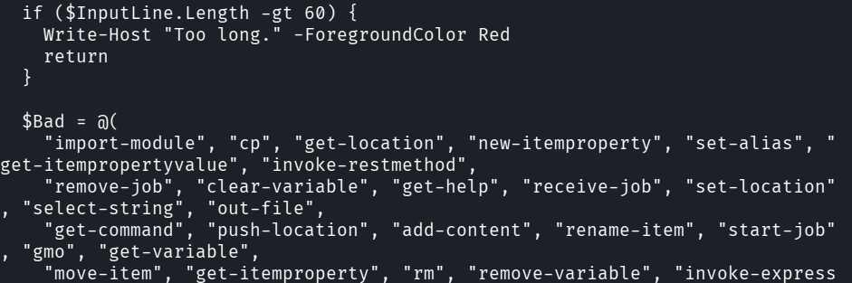
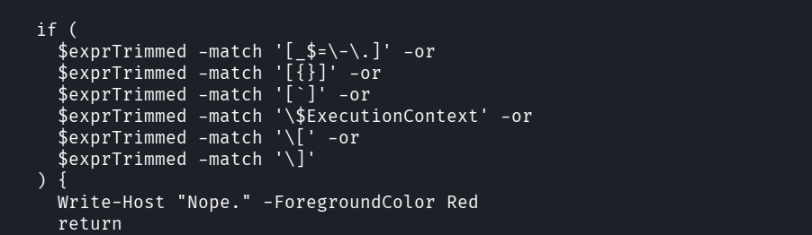
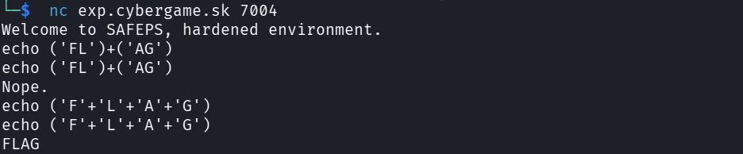
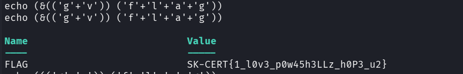
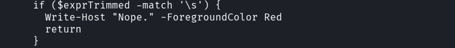
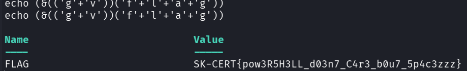

## JailPS

The JAilPS is a challenge from category of offensive security.
The challenge resolved bypassing of a powershell filter.
I was given a script with ps filter and a netcat connetction to the host.
## Analysis 

The goal is to grab the flag which is stored in the `FLAG` variable.
The script allows commands `help,about,echo,time`.
It also limits the length of a command to be max 60.

Then there is long list of commands that are blacklisted.
There lies the challenge. 
The blacklist is very effective and doesn't let anything that could potentionaly grab flag pass.

Then there is a condition so that uppercases don't differ from lowercase.
and also a condition that blocks special characters like slasher braces and some other conditions.
## Solution
The first vulnerability lies in this condition because regular bracets `()` are not included.
We can also utilize echo beacuse it is white listed.
After some digging i found out that echo('flag') is banned however echo('f'+'l'+'a'+'g') works.

It echoes.
So that way i can bypass filter so command i want is `gv flag`. 
And the final solution is `echo (&(('g'+'v')) ('f'+'l'+'a'+'g'))` with & so the command gets executed.

## Part 2
Jail pt2 was actually very easy after figuring out the first one.
This time i ws provided with same script but the vulnerability was patched.

The first patch is that they banned spaces.
But that is not a big deal beacause using separate brackets in echo serves.
So you just remove space from the last payload and you are good to go.

